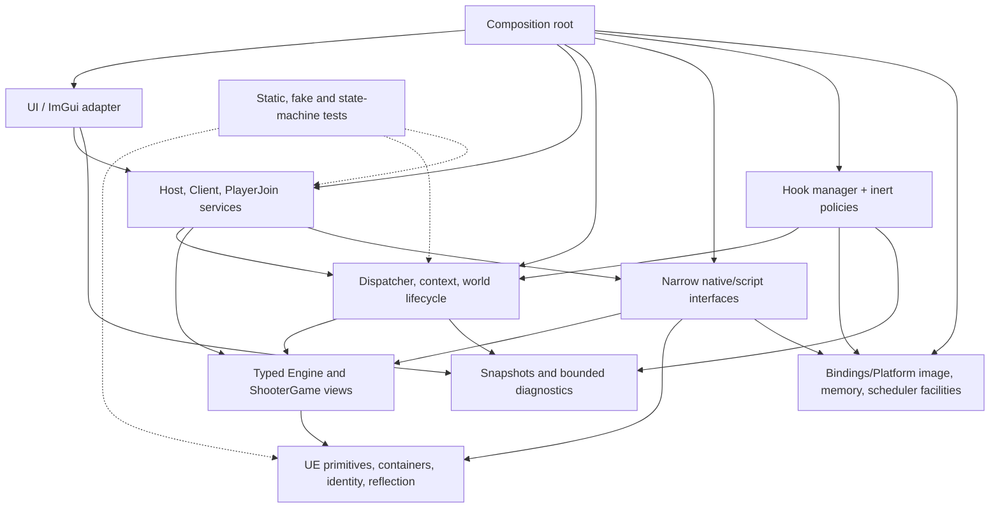

# Server-Host V2 architecture

This document is the implementation boundary for a separate `SourceV2` target.
It does not authorize edits to the legacy target or claim that an address from a
reference project is valid for ShooterGame 1.10280.

## 1. Evidence and design notation

Statements in this document use three meanings:

- **Fact** — established by current source, the exact 1.10280 iOS binary,
  FreshSDK, a preserved binary, or an observed device result. The evidence ID is
  given where practical.
- **Decision** — the V2 architecture selected from the facts. A decision is not
  an engine ABI claim.
- **Hypothesis** — an explanation that still requires the named IDA or device
  experiment.

Source precedence for a current contract is:

1. a reproducible live 1.10280 device observation and captured artifact;
2. decompilation/disassembly of the exact platform binary;
3. current FreshSDK plus live reflection/layout validation;
4. the exact Android binary, when its workflow becomes active;
5. cooked assets and configuration;
6. the closest matching Epic engine source;
7. Sishen and Dragon as code-pattern authorities;
8. SEA material as control-plane/product evidence.

Conflicts are not averaged. The higher source wins for that build, and the
conflict is recorded in `EVIDENCE.md` or `ABI_BACKLOG.md`. Sishen offsets,
signatures, vtable slots and calling conventions are never promoted by analogy.

## 2. Architectural decisions

1. `SourceV2` is a new target. `Source`, `UE`, `Memory`, `Hooks` and the current
   tweak remain regression and research inputs.
2. Feature and UI code never performs pointer arithmetic, calls a vtable slot,
   builds a ProcessEvent buffer, scans an image, or owns a raw `UObject*` across
   a scheduling boundary.
3. ABI access is limited to the lowest `UE` core, `Bindings` (including its
   platform facilities), and the lowest part of `Hooks`. Typed model views
   expose validated values and narrow operations.
4. Every live object retained across a frame is an index-plus-serial identity.
   Resolving it produces a short-lived borrow tied to the current world
   generation.
5. All UObject reads that require consistency and all gameplay mutations occur
   on the game thread. UI, Metal and hook callbacks publish bounded commands or
   counters only.
6. Build profiles contain evidence, not policy. A profile must match the loaded
   image and pass runtime validators before a binding becomes available.
7. Hook transport and hook policy are separate. The first hook gate is inert.
   No behavior-changing hook is enabled until its original-call, uninstall,
   reentrancy and device-soak contracts are proven.
8. Native game initialization is preferred over forcing `NM_DedicatedServer`.
   GetNetMode caller whitelists remain research instruments unless exact binary
   and device evidence proves that no game-native path exists.
9. The typed surface grows per workflow. FreshSDK is an input to a curated
   layer, not a public V2 SDK.
10. **`DEC-V2-NO-HOOK-FIRST-HOST`** — the first V2 IP Listen transport is a
    no-hook workflow. `UEngine::Init` is not a required hook: exact Engine
    identity and definitions are explicitly revalidated before the future Host
    command. `UWorld::BeginPlay` is not a required hook: future Start targets
    the current validated world through the Gate 3 game-thread dispatcher.
    `UNetDriver::GetNetMode` initially returns its original value, broad
    Dedicated forcing is forbidden, and hook transport is not a dependency of
    first Listen. An inert observer may be introduced only after a concrete
    lifecycle/replication contract cannot be proved by read-only observation or
    a direct call. A behavior-changing narrow GetNetMode policy requires both a
    successful original-mode transport test and a demonstrated replication gap.

The authoritative post-Gate-2B workflow order is: Gate 2C live relationships;
Gate 3 game-thread dispatcher; Host native-contract research; minimal IP Listen
with original NetMode; typed client travel; replication validation; optional
inert hooks or narrow policy only if required; remote-player gameplay; then
save, administration and stability. Earlier evidence is retained even where
this decision changes the order of future work.

## 3. Proposed source tree and build files

The following is the complete planned tree through stable iOS gameplay. Files
marked `[future]` define a boundary but must not be implemented until their gate
is active.

```text
SourceV2/
  Bootstrap/
    V2Entry.mm                 composition root and explicit startup phases
    RuntimeComposition.hpp/.mm owns concrete services and shutdown order
  Core/
    ContractResult.hpp         typed failure/category/evidence context
    BuildIdentity.hpp/.cpp     immutable loaded-image identity
    ThreadToken.hpp            game-thread proof token
    ObjectIdentity.hpp         index, serial and world generation
    Redaction.hpp/.cpp         secrets and endpoint-safe formatting
  UE/
    Primitives.hpp             fixed-width UE scalar aliases and enums
    Containers.hpp             borrowed TArray views and owned UE buffers
    String.hpp/.cpp            FString view/owner and UTF conversion
    Name.hpp/.cpp              FName value and FNamePool read access
    ObjectArray.hpp/.cpp       GUObjectArray view and identity resolution
    Object.hpp/.cpp            UObject/UField/UStruct/UClass views
    Reflection.hpp/.cpp        UFunction/FProperty descriptors and validation
  Model/
    Engine/
      LiveRelationships.hpp/.cpp Engine, viewport, world, driver, generations
      GameplayViews.hpp/.cpp   GameModeBase, PlayerController, PlayerState
    ShooterGame/
      ShooterViews.hpp/.cpp    game mode/state, ShooterPC/state, PlayerData
  Bindings/
    Profiles/
      BuildProfile.hpp         evidence-backed profile schema
      IOS_1_10280.hpp/.cpp     current iOS profile and contract cards
    Resolver/
      BindingResolver.hpp/.cpp signature/RVA/vtable resolution orchestration
    Generated/
      Layouts_1_10280.hpp      curated generated layout constants/assertions
      Params_1_10280.hpp       curated reflected parameter records/assertions
    Native/
      EngineNative.hpp/.cpp    narrow Listen/travel/driver lifecycle bindings
      ShooterNative.hpp/.cpp   proven native ShooterGame operations only
    Script/
      ScriptInvoker.hpp/.cpp   validated ProcessEvent transport
      PlayerFlowScript.hpp/.cpp recovery RPC wrappers required by Gate 8
    Validation/
      ContractValidator.hpp/.cpp startup and per-use binding validators
    Platform/
      MachOImageView.hpp/.cpp        bounded Mach-O metadata parser
      MemorySource.hpp/.cpp         injected/process bounded copy source
      LoadedImageCatalog.hpp/.cpp   owned loaded-image catalog
      ImageIdentityResolver.hpp/.cpp stable executable-text identity
      ExactProfileSelector.hpp/.cpp unique exact-profile proof/receipt
      CheckedMemoryReader.hpp/.cpp  single-segment typed read boundary
      Android/                 [future: only after exact LibUE path/profile]
  Hooks/
    HookTypes.hpp              target, callback, original and lifecycle types
    HookManager.hpp/.cpp       registration, validation and lease ownership
    HookObserver.hpp           allocation-free counter/event sink
    IOS/
      HardwareBreakpoint.mm    quarantined backend candidate
      Trampoline.mm            quarantined backend candidate
    Policies/
      LifecycleObserver.hpp/.cpp inert Init/BeginPlay observations
      NetModeObserver.hpp/.cpp  inert GetNetMode call-site counters
  Runtime/
    Command.hpp                bounded workflow command/result variants
    CommandDispatcher.hpp/.cpp MPSC ingress, game-thread drain, completion
    RuntimeContext.hpp/.cpp    build/world/driver/object generations
    WorldLifecycle.hpp/.cpp    transition detection and invalidation
  Services/
    HostService.hpp/.cpp       host state machine
    ClientService.hpp/.cpp     travel/connect/readiness state machine
    PlayerJoinService.hpp/.cpp remote-player state machine and fallback
    SaveService.hpp/.cpp       [future: Gate 10]
    AdministrationService.hpp/.cpp [future: Gate 11]
  Diagnostics/
    Logger.hpp/.cpp            bounded structured log with redaction
    Breadcrumbs.hpp/.cpp       allocation-free recent transition ring
    DiagnosticSnapshot.hpp/.cpp immutable Gate 1.5 UI/support snapshot
    ContractReport.hpp/.cpp    binding validation report
    DeveloperProbe.hpp/.cpp    compile-time-disabled bounded probes
  UI/
    DiagnosticPresentationModel.hpp/.cpp portable Status/Logs refusal model
    DiagnosticUIBootstrap.hpp/.mm scene-safe UIKit + paused Metal/ImGui adapter
    HostViewModel.hpp/.cpp     immutable display state and command creation
    ImGuiHostPanel.hpp/.cpp    presentation only
  Tests/
    Static/
      LayoutTests.cpp          sizeof/align/offsetof/profile assertions
      BoundaryAudit.sh         regex raw-access/include-layer/Legacy-boundary checks
    Fakes/
      FakeObjectStore.hpp/.cpp identities, generations and invalidation
      FakeBindings.hpp/.cpp    scripted binding results and call recording
      FakeScheduler.hpp/.cpp   deterministic game-thread scheduling
    Unit/
      NameStringTests.cpp
      ObjectIdentityTests.cpp
      ReflectionTests.cpp
      DispatcherTests.cpp
      HostStateTests.cpp
      ClientStateTests.cpp
      PlayerJoinStateTests.cpp
    Device/
      README.md                manual gates and required captured artifacts
SourceV2.mk                    separate source lists and build switches
```

Proposed build targets:

| Target | Files | Purpose / restrictions |
|---|---|---|
| `serverhost_v2_core_tests` | `Core`, portable parts of `UE`, `Runtime`, service state machines, `Tests/Static`, `Tests/Fakes`, `Tests/Unit` | Host-local, no UIKit, Mach, hooks or live UE dependency. Must run before an iOS package. |
| `ServerHostV2` | all non-test iOS files listed above except future modules and disabled developer probes | Separate bundle/dylib identity. It must not link legacy `HostingRuntime`, legacy UE core, or legacy hook objects. |
| `ServerHostV2Diagnostics` | same code graph as `ServerHostV2`, with observer probes and contract report enabled | Developer package only; observer policy remains inert. No separate gameplay implementation. |

`Makefile` continues to build the legacy artifact unchanged. `SourceV2.mk` is
included only by an explicitly selected V2 target. Source lists are explicit;
recursive wildcards are forbidden because a new ABI-bearing file must be
reviewed before it enters an artifact.

Gate 1.5 implements only `Diagnostics/Logger`, `DiagnosticSnapshot`, the
portable diagnostic presentation model and the UIKit/Metal adapter. The future
service-backed `HostViewModel`/`ImGuiHostPanel` remains unimplemented. The
adapter may depend on UIKit/MetalKit and local ImGui, but not UE, Bindings,
Hooks, Runtime, Services or Legacy sources. Its closed `MTKView` is paused; its
render delegate captures only an immutable diagnostic snapshot.

Gate 2A adds only the `Bindings/Platform` image-identity and checked-read
boundary plus an immutable diagnostics receipt. The runtime performs no
FNamePool/GUObjectArray scan, UE discovery, hook, engine call or mutation. Raw
Mach-O addresses and ASLR slide remain private to `Bindings/Platform` and never
enter the UI snapshot.

Gate 2C adds `LiveRelationshipProfile`, typed value-only relationship views and
an explicit bounded capture. Every relationship read begins with a fresh Gate
2B owned snapshot; raw roots and object storage stay in `Bindings`, while the UI
receives only names, class-validation results, lifecycle state and discovery/
world generations. No pointer survives capture, and no timer, per-frame poll,
hook, native call or mutation is introduced.

Device result `V2-G2C-ENGINE-VALIDATOR-ABORT-001` also fixes the class-anchor
boundary: game-specific UClass object-array indices from SDK dumps are never
profile ABI. The live Engine's direct class is resolved by its fresh snapshot
identity/serial/generation and validated as exact
`Class ShooterGame.ShooterEngine`; separately proven core GameEngine/Engine
anchors remain super-chain validators. No class pointer or index is retained
between captures.

Device result `V2-G2C-ENGINE-FULLNAME-ABORT-002` further separates the live
instance-name boundary. The required identity remains
`ShooterEngine Transient.ShooterEngine_<digits>`. Only the exact transient
package-path spelling `/Engine/Transient` is canonicalized to `Transient`, as
grounded by closest UE source and the exact FreshSDK `Package Transient` dump.
Class/CDO/direct-UClass/ancestry checks precede the instance full-name check;
failure exposes only bounded printable name shape and never an address. No
root, offset, capability or lifetime rule changes.

Device result `V2-G2C-MAP-RELATIONSHIPS-PASS-003` validates this boundary in
one live TheIsland capture: the native Engine root, exact dynamic ShooterEngine
class/ancestry, GameViewport, GWorld/ViewportWorld identity, definitions and a
normal null NetDriver all passed through typed value views. Discovery and world
generation remain deliberately separate. The first capture established world
generation 1; it does not yet prove same-world stability or transition
invalidation, so no raw handle may be retained and Gate 3 remains closed.

Build result `V2-G2C-OPTIONAL-RELATIONSHIP-RECEIPT-BUILD-013` corrects only the
diagnostic boundary exposed by that device result. `AuthorityGameMode` and
`GameState` presence are copied from existing owned optional views into bounded
redacted present/none/not-applicable states. This adds no heap read, class
resolution, offset, pointer lifetime or capability; the typed capture boundary
is unchanged.

Device result `V2-G2C-OPTIONAL-RELATIONSHIPS-MAP-PASS-004` validates the
positive publication path: both optional views were present and displayed only
their validated base-class status. It remains a first world-generation sample,
so the architecture still rejects cross-capture handles until same-world and
transition behavior are device-demonstrated.

## 4. Dependency graph



There are no upward edges. In particular, lowest `UE` and `Bindings` (including
its Platform subtree) do not include services or UI; hooks do not call
HostService directly; model views do not log or schedule work.

### 4.1 Directory contract matrix

This matrix applies to every file below a proposed directory. More specific
class/interface rules in Section 5 narrow these permissions further.

| Directory | Responsibility | Allowed / forbidden dependencies | Ownership, thread and raw ABI | Migration/pattern/evidence gate |
|---|---|---|---|---|
| `Bootstrap` | Composition, startup states and reverse-order teardown. | May construct all modules; forbidden: feature logic and direct raw ABI. | Process owner; explicit startup thread then scheduler-controlled teardown; no raw ABI. | Replaces loader/singleton startup; adapts Sishen phase clarity, rejects delayed constructor. Requires failure-injection and unsupported-profile tests. |
| `Core` | Portable errors, IDs, thread proof and redaction values. | Standard library only; forbidden: UE, Mach, ImGui. | Value/immutable ownership; any thread as declared; no raw ABI. | Replaces shared primitive/status utilities. Host-static evidence only. |
| `UE` | Minimum engine-compatible values, borrowed low views, object identity and reflection descriptors. | Core and injected checked-memory/name/object facilities; forbidden: services/UI/game policy. | Engine storage is borrowed; retained state is identity/value; consistent access on game thread; raw ABI allowed only in lowest view implementations. | Re-derived from legacy plus FreshSDK with Sishen/Dragon patterns; static and live layout/reflection gates. |
| `Model/Engine` | Validated semantic views of required Engine relationships. | UE + validated layout descriptors; forbidden: resolver, hooks, UI, mutation policy. | Scoped borrows/game thread; raw layout hidden inside view accessor. | Replaces raw monolith fields; Dragon typed ergonomics adapted. Exact SDK/binary/live relationship proof. |
| `Model/ShooterGame` | Minimum game-specific relationships for active host/join workflow. | Model/Engine + UE + curated Shooter layout; forbidden: broad admin/gameplay catalog. | Same scoped game-thread model; no exposed raw field. | FreshSDK/Dragon shape plus exact current proof per member. |
| `Bindings/Profiles` | Immutable build/function/layout/vtable evidence declarations. | Core only; forbidden: scanning, state or feature policy. | Process immutable; describes raw ABI. | Splits legacy profile/offset/config and Sishen offsets organization. Exact provenance/category required. |
| `Bindings/Resolver` | Exact-image resolution and semantic validation orchestration. | Profiles, Bindings/Platform, Validation; forbidden: services/UI. | Bootstrap then immutable results; raw RVA/signature/instruction access permitted. | Adapts current/Sishen resolver concepts; exact binary unique-match and negative-build gate. |
| `Bindings/Generated` | Curated, reviewed layout and parameter slices. | UE primitives only; forbidden: complete SDK include graph. | Compile-time ABI declarations. | Reduced from FreshSDK; every member requires static/live evidence. |
| `Bindings/Native` | Narrow, typed current native calls. | Resolver, typed Model, ThreadToken; forbidden: UI, hook policy, workflow state. | Binding process lifetime, arguments scoped, game thread; raw call/vtable ABI permitted internally. | Splits monolith calls; Sishen wrapper style adapted. Exact card plus device postcondition. |
| `Bindings/Script` | Validated ProcessEvent transport and approved typed wrappers. | UE Reflection, Generated params, Model, ThreadToken; forbidden: generic feature-facing calls. | Function/target handles generation-bound; params stack/owned; game thread; ProcessEvent raw ABI internal. | Adapts legacy validation/Sishen wrappers, rejects flag mutation. Live metadata and device gate. |
| `Bindings/Validation` | Convert resolved declarations/live observations into available/unavailable contracts. | Profiles, UE, Model and Bindings/Platform reads; forbidden: retries/game mutation. | Bootstrap/game-thread revalidation; read-only ABI inspection. | Consolidates scattered checks. Static negative and device report gate. |
| `Bindings/Platform` | Own loaded-image discovery, bounded Mach-O parsing, exact identity/profile selection and the only checked read mechanism. | Core, profiles and Apple APIs; forbidden: UE/game semantics, services and UI. | Metadata/results are owned; reads are bounded operations; raw Mach/image ABI is private to this directory. | Adapts Sishen's organizational boundary only; rejects substring selection, cached global bases, coarse address checks, writes and calls. Exact-image and negative-profile gates. |
| `Bindings/Platform/Android` `[future]` | Android image/memory/scheduler equivalents. | Same interface only; forbidden: importing iOS/Sishen ABI. | Defined when exact LibUE profile exists. | No implementation before user supplies exact database and iOS stabilizes. |
| `Hooks` | Hook types, manager/leases, observer sink and backend-neutral lifecycle. | Core, Bindings/Platform, Diagnostics fixed sink; forbidden: services/UI/reflection in callback. | Explicit manager/lease lifetime; callback-safe; raw ABI only in backend. | Replaces global hook state; full HookSpec/inert soak required. |
| `Hooks/IOS` | Candidate hardware-breakpoint/trampoline transports. | Hooks + Bindings/Platform/IOS; forbidden: gameplay policy. | Owns exception/debug/executable state and uninstall; arbitrary callback thread; raw ABI permitted. | Current/Sishen mechanisms are quarantined research. Relocation/chaining/thread/reentrancy/device proof. |
| `Hooks/Policies` | Small inert or separately approved semantic policies. | Hook observer + bounded Runtime ingress; forbidden: raw target manipulation, formatting, reflection. | Callback stack/atomics only; no raw ABI. | Current inline policy is split. Original-equivalence first. |
| `Runtime` | Typed commands, bounded dispatch, context and world lifecycle. | Core, scheduler interfaces, Model factories, Diagnostics; forbidden: raw ABI/ImGui/hook backend. | Composition-owned, game-thread mutable; immutable cross-thread results. | Decomposes monolith queue/cache/world reset; static/device thread gates. |
| `Services` | One state machine per user outcome. | Runtime, typed Model and narrow binding interfaces; forbidden: offsets, UObject pointers, hooks, ImGui. | Runtime-owned; game-thread transitions; request/result values cross threads. | Rewrites workflow groups rather than copying monolith. State tests, ABI cards and per-service device gates. |
| `Diagnostics` | Bounded logs, breadcrumbs, snapshots, contract reports and expiring developer probes. | Core values and typed snapshots; forbidden: owning feature state or hot formatted hook work. | Fixed/bounded process storage; producers any thread under sink contract; no raw ABI. | Preserves bounded/redacted intent. Static overflow/redaction and device sink/crash gates. |
| `UI` | ImGui presentation and command construction. | Service ports and Diagnostics snapshots only; forbidden: UE, Bindings, Hooks, raw platform. | Render/UI thread, immutable values only; no raw ABI. | Rewrites HostMenu/Overlay boundary. UI/dependency and device no-mutation gate. |
| `Tests/Static` | Compile-time ABI and dependency enforcement. | Portable target and curated declarations; forbidden: live UE assumptions as passing evidence. | Host process; no raw live ABI. | New gate required by RULES. Clean deterministic run. |
| `Tests/Fakes` | Deterministic identities, generations, bindings and scheduler. | Core/public interfaces only; forbidden: Mach/live game. | Test-owned/thread controlled; no raw ABI. | Provides seams absent in monolith. Negative-path coverage. |
| `Tests/Unit` | Value, reflection, dispatcher and state-machine behavior. | Portable production interfaces + fakes; forbidden: platform hook dependence. | Host process; no raw live ABI. | Must pass before build/device claims. |
| `Tests/Device` | Versioned user protocols and required artifact schemas. | Documentation/build outputs; forbidden: claiming a pass before user evidence. | External device/user-owned evidence. | Encodes each Roadmap entry/exit and rollback control. |

## 5. Module and interface contracts

“Raw ABI” means pointer arithmetic, engine-owned memory layout, a signature,
vtable dispatch, ProcessEvent, or executable-memory manipulation.

### 5.1 Core and UE foundation

| Unit / important class | Responsibility | Allowed / forbidden dependencies | Ownership and thread | Raw ABI | Legacy and reference disposition | Evidence required before implementation |
|---|---|---|---|---|---|---|
| `Core/ContractResult<T>` | Carry value or categorized contract failure without exceptions crossing callbacks. | Standard library/Core only; no UE, logging or UI. | Value-owned; any thread. | No. | Replace thrown `TArray::at` and boolean/error-string mixtures. Sishen has no comparable error boundary. | Static tests for propagation and no allocation on configured hot paths. |
| `Core/BuildIdentity` | Store product/version, architecture, image role, UUID, stable segment sizes and executable-text fingerprint; never store runtime base/slide. | Bindings/Platform only at construction; no profile selection policy. | Immutable process lifetime. | No. | Splits legacy global base/RVA state without exporting addresses. | Mach-O identity captured from the loaded 1.10280 image and matched to the profile. |
| `Core/ThreadToken` | Unforgeable proof that the caller is in the dispatcher’s game-thread drain. | Runtime may construct; services/bindings may consume. | Stack lifetime, game thread only. | No. | Replaces scattered `IsOnGameThread` assertions. | Fake scheduler tests and device thread-ID breadcrumb. |
| `Core/ObjectIdentity` | `{objectIndex, serial, discoveryGeneration}` snapshot identity; Gate 2C later adds a separate world generation. | Core only. Feature code may store it; raw pointers forbidden. | Value-owned; any thread; resolution is against the owning immutable snapshot. | No. | Adapt legacy `FWeakObjectIdentity`; correct equality includes serial and discovery generation. Dragon weak equality by index is rejected. | Object deletion/reuse fakes, repeated-capture invalidation and live GUObject serial validation. |
| `UE/Primitives` | Fixed-width scalars, alignment helpers and only required enums. | Core only; forbidden: generated class headers. | Value types. | Layout definitions. | Curate FreshSDK values; do not copy Sishen ABI. | arm64 static assertions and current SDK/binary corroboration. |
| `UE/BorrowedArrayView<T>` | Read a validated engine TArray without owning/freeing its data. | Core/Primitives; no allocator or services. | Borrow ends before generation/thread transition; normally game thread. | Yes, isolated template. | Replace legacy `TArray` that mixes mutation, realloc and reads. Sishen/Dragon shape is a layout clue only. | `sizeof/align/offset` checks, count/capacity/range guards, fake malformed arrays. |
| `UE/EngineOwnedArray<T>` | Explicit RAII buffer allocated by the bound UE allocator, with `release` or one-time transfer to UE. | UE allocator binding injected at construction; no global realloc. | Unique owner; game thread when containing UObjects. | Yes. | Adapt useful allocator concept; reject implicit global `EngineRealloc` and shallow copies. | Exact allocator/free pairing or no use in the first workflow; ownership tests. |
| `UE/FStringView`, `OwnedFString` | Separate borrowed engine strings from owned, terminated UTF-16 buffers and conversions. | Containers/Core; allocator supplied explicitly. | View is scoped; owner move-only. | Yes. | Reject legacy non-owning `FString(const char16_t*)` masquerading as ownership. Generated SDK layout is input. | Layout assertions; emoji/surrogate, empty, embedded-NUL policy tests; SetClientTravel device proof. |
| `UE/FName`, `FNamePoolView`, `INameResolver` | Preserve comparison index and number; read names safely; resolve/create names only through a proven binding. | Primitives/Core/Bindings Platform Memory interface for low view. No feature-level pool scans. | `FName` value; pool process lifetime but access synchronized/validated. | Yes in pool view. | Adapt Sishen name utility organization; reject its offsets and unchecked pool dereference. | Exact 1.10280 pool layout/signature, FreshSDK comparison, live known-name round trip. |
| `UE/ObjectArrayView` | Bounds/range/serial checked GUObjectArray access. | Primitives/Core/Bindings Platform Memory interface; no reflection policy. | Process-lived view; returned UObject borrow is scoped. | Yes. | Replace legacy and Dragon/Sishen off-by-one-prone helpers. | Profile resolution plus live `Engine`, `World`, known class checks. |
| `UE/ObjectHandle<T>` | Resolve `ObjectIdentity` through ObjectArray and class/generation validator for one scope. | ObjectArray/Object; no caching raw pointer. | Stored identity; scoped borrow game thread. | No outside resolver. | Adapt Dragon `TWeakObjectPtr::GetSafe` intent; strengthen serial/world checks. | Fake reuse tests and world-travel device test. |
| `UE/UObjectView`, `UStructView`, `UClassView` | Minimum reflected identity, class chain, full name and structure metadata. | ObjectArray/Name; forbidden: game-specific fields. | Scoped borrow; game thread unless immutable snapshot. | Yes internally. | Curate Sishen `GameStructs`/StaticClasses rather than empty legacy tags or a wholesale SDK. | Layout assertions, exact class-chain/full-name live checks. |
| `UE/UFunctionDescriptor`, `FPropertyDescriptor`, `ReflectionRegistry` | Validate function flags, `ParmsSize`, `NumParms`, property offset/size/bool mask; cache by identity+generation. | UE objects/name only; no ProcessEvent call. | Registry owned by RuntimeContext; game-thread cache, invalidated by generation. | Yes internally. | Split legacy `ResolveFunctionCached`; reject Sishen/Dragon forever-static raw `UFunction*` and flag mutation. | Current SDK metadata plus live reflection equality and malformed-fixture tests. |

### 5.2 Typed model and bindings

| Unit / important class | Responsibility | Allowed / forbidden dependencies | Ownership and thread | Raw ABI | Legacy and reference disposition | Evidence required before implementation |
|---|---|---|---|---|---|---|
| `Model/Engine/EngineView` | Read GameViewport and NetDriverDefinitions through validated field descriptors. | UE + immutable validated layout set. No resolver, logging or hooks. | Scoped borrow, game thread. | Hidden in accessor implementation. | Replace `FindEngine`, `ValidateLiveEngine` and raw `+0x780/+0xBF8`. Dragon’s typed-field ergonomics are adopted, direct public fields rejected. | FreshSDK + exact binary + live class/field checks. |
| `WorldView` | Read net driver, authority game mode, game state and world identity. | Same as EngineView. No creation or Listen policy. | Scoped to world generation, game thread. | Hidden. | Replaces repeated `GWorld` and offsets in the monolith. | `UWorld` fields checked against both dumps and live object relationships. |
| `NetDriverView`, `NetConnectionView` | Read world ownership, server/client connections, mode and connection readiness. | UE/layout only. | Scoped game-thread borrows; connection list copied to snapshot as identities. | Hidden. | Migrate `UpdateConnectionDiagnostics` as bounded typed observations. | Layout checks and host/client live relationship snapshot. |
| `GameplayViews` | Minimum GameModeBase, PlayerController and PlayerState relationships used by join readiness. | Engine views/UE reflection. No Shooter-specific guessing. | Scoped game thread. | Hidden. | Replaces repeated class-name/offset tests. | Workflow field list must be proven before addition. |
| `ShooterViews` | Minimum ShooterGameMode, ShooterGameState, ShooterPC/State and PlayerData relationships. | GameplayViews + curated Shooter layouts. No administration surface. | Scoped game thread. | Hidden. | Dragon’s direct typed usage informs ergonomics; FreshSDK class declarations inform shape. | Exact fields/function metadata for the active join step plus live checks. |
| `BuildProfile` | Declare image identity, signature cards, vtable cards and layout cards with provenance. Each hardcoded item is labeled stable-engine ABI, runtime-reflected property, exact-build hidden layout, exact-class vtable byte offset/index, or guarded current-build RVA fallback. | Core values only; no scanners or services. | Immutable process lifetime. | Describes ABI, does not execute it. | Split `GeneratedSDKProfile.hpp` and HostingConfig constants. | Every entry has exact source, uniqueness scope, validator and failure policy. |
| `BindingResolver` | Match profile, scan exact image segments, resolve unique target, run local validators. | Profile + Bindings/Platform + ContractValidator. No service policy. | Bootstrap/game thread before exposure; results immutable. | Yes. | Adapt legacy signature machinery; reject first-match and silent hardcoded fallbacks. Sishen centralized offsets is organizational input only. | Unique hit, instruction/call-target validation, image fingerprint and negative-profile test. |
| `Layouts_1_10280`, `Params_1_10280` | Curated constants and parameter structs needed by an approved workflow. | UE primitives only. Must not include full generated SDK. | Compile-time. | ABI declarations. | Reduce FreshSDK; Full-Version difference does not affect near-term layouts. | Static asserts and live reflection cards for every emitted member. |
| `IEngineNative` / `EngineNative` | Narrow bindings such as validated `Listen`, `SetClientTravel` and driver destruction when their workflow is active. | Model, resolver, thread token. No host state machine or UI. | Binding process lifetime; calls game thread. | Yes in implementation. | Split `TryStartHosting`, `ExecuteJoin`, `ExecuteStop`. Original-call functions are typed. | Exact signature/decompile or exported contract, runtime preconditions and observed postcondition. |
| `IShooterNative` / `ShooterNative` | Only proven game-native initialization/save/admin operation for the active workflow. | Shooter model + resolver + thread token. | Same. | Yes in implementation. | RouteHostedPostLogin, save vtable and login-lock code stay research until proven. | Exact 1.10280 call chain and device postcondition per operation. |
| `IScriptInvoker` / `ScriptInvoker` | Perform ProcessEvent after target/function/params validation; never mutates FunctionFlags. | Reflection, ProcessEvent binding, thread token. | Stack parameter buffer; game thread; UObject borrows valid for call only. | Yes. | Adapt legacy validation and Sishen one-wrapper pattern; reject global raw caches and flag mutation. | Exact ProcessEvent target/index plus live harmless invocation and negative tests. |
| `IPlayerFlowScript` / `PlayerFlowScript` | Typed wrappers for the two evidenced recovery RPCs only. | ScriptInvoker + Shooter views. | Game thread; zero-initialized typed params. | Parameter ABI only. | Migrate `DispatchRecoveryRPCs`; compare Sishen/Dragon wrapper style but use current FreshSDK bool parameter. | `ParmsSize`, `NumParms`, flags and current client device result. |
| `ContractValidator` | Produce structured available/unavailable bindings and exact failure reasons. | UE/model/profile/platform. No retries or gameplay mutation. | Bootstrap and game thread revalidation. | Reads ABI. | Consolidates scattered `IsReadable` checks. | Static negative fixtures and device contract report. |

### 5.3 Platform, hooks and runtime

| Unit / important class | Responsibility | Allowed / forbidden dependencies | Ownership and thread | Raw ABI | Legacy and reference disposition | Evidence required before implementation |
|---|---|---|---|---|---|---|
| `Bindings/Platform/IImage`, `IMemory` | Query exact image, mapped segments, protections, safe reads and cache operations. | Core only. No UE semantics. | Process lifetime; read methods thread-safe. | Yes, within the permitted Bindings boundary. | Adapt `CGPMemory`/Sishen Memory separation; reject singleton base bug, coarse address heuristics and unscoped writes. | Unit fixtures and loaded-image/segment device report. |
| `IGameThreadScheduler`, `IOSGameThread` | Schedule a bounded drain using `FIOSAsyncTask` and establish game-thread identity. | Core + Runtime callback interface. No services. | Thread-safe enqueue; callback game thread. | Platform bridge only. | Migrate `ScheduleGameThreadTick`; UE4.17 confirms queued callbacks are processed on game thread and may requeue. | Device thread IDs across launch/travel/background and shutdown proof. |
| `HookManager`, `HookLease`, `IHookBackend` | Validate target, install/uninstall, expose original call, own hook lifetime and fail closed. | Bindings/Platform + HookTypes + Diagnostics counter sink. No gameplay services. | Manager process lifetime; lease explicit; callback constraints per hook. | Yes in backend only. | Replace global legacy managers. Sishen VMTHook/CDO mutation is rejected. | Original equivalence, nesting/reentrancy, uninstall and 15-minute inert soak. |
| `HardwareBreakpoint` backend | Candidate transport using debug registers and exception handling. | Mach/Memory only. | Must own thread registration and restore prior exception/debug state. | Yes. | Existing backend is quarantined: six-slot limit, incomplete thread lifecycle/exception chaining/uninstall and replay-trampoline risk. | Dedicated device test for new/exiting threads, exception chaining, recursion, performance and clean uninstall. |
| `Trampoline` backend | Candidate instruction-safe trampoline transport. | Disassembler/Memory only. | Install at controlled phase; callback hot-path safe. | Yes. | In-place text patching that caused Invalid Page is rejected. Sishen/legacy blindly copied prologues are rejected. | Relocation proof for every overwritten instruction, codesign-safe strategy, original-call device test. |
| `HookObserver` | Allocation-free per-target/caller counters and small POD breadcrumb publication. | Fixed ring/atomics only. No names, reflection, mutex or formatted log. | Hook callback/hot path. | No. | Replaces hot-path logging/sampling mixed into policy. | Contention and overflow tests; device profile. |
| `LifecycleObserver`, `NetModeObserver` | Inert callback policies: call original and record bounded facts. | HookObserver + Runtime event ingress. No mode mutation. | Callback-safe. | No. | Derive from legacy hooks but remove behavior changes. | Byte-for-byte return equivalence and no-regression device gate. |
| `CommandDispatcher` | Bounded MPSC command ingress, one game-thread drain and immutable completion results. | Core/Scheduler/Diagnostics. It dispatches to registered service ports, not raw bindings. | Producers any thread; consumers game thread. | No. | Adapt legacy 64-command bound; replace ad-hoc flags and render-thread calls. Dragon unbounded `std::function` queue is rejected. | Full/overflow/order/shutdown fake tests and live thread breadcrumbs. |
| `RuntimeContext` | Own current build contract, world generation, identities and service session IDs. | UE registries/model factories/diagnostics. No UI. | Owned by composition root; mutations game thread; snapshots immutable. | No. | Split monolith globals and caches. | World travel/reuse fake tests and device invalidation gate. |
| `WorldLifecycle` | Detect Engine/World/driver transitions, increment generation and notify services after invalidation. | RuntimeContext + typed views. No raw GWorld polling outside its binding. | Game thread. | No. | Rewrite `HandleWorldChanged`/`ResetWorldDependentCaches`. | Launch, travel, return-menu and reconnect observations. |

### 5.4 Services, diagnostics and UI

| Unit / important class | Responsibility | Allowed / forbidden dependencies | Ownership and thread | Raw ABI | Legacy and reference disposition | Evidence required before implementation |
|---|---|---|---|---|---|---|
| `HostService` | Execute one host state machine and publish state/postconditions. | Runtime ports, typed views, narrow native bindings, diagnostics. Forbidden: offsets, hooks, UI and direct ProcessEvent. | Runtime-owned; all transitions game thread; request/result values cross threads. | No. | Decompose Request/ExecuteHost, patches and TryStartHosting. Broad forced dedicated policy is not migrated. | State tests, native-init ABI card, listen/ownership/port device gates. |
| `ClientService` | Execute travel, transport, controller readiness and return-to-menu lifecycle. | Runtime, EngineNative, typed views. Same prohibitions. | Game thread state; immutable snapshots. | No. | Decompose Join/ReturnToMenu and connection diagnostics. | SetClientTravel contract and physical-device transport/cleanup tests. |
| `PlayerJoinService` | Track each remote identity through readiness, native flow or bounded compatibility recovery. | Runtime, Shooter views, IPlayerFlowScript, diagnostics. No hook backend. | Per-session records keyed by full identity; game thread. | No. | Migrate the confirmed recovery state machine, not native PostLogin experiments. | Current RPC metadata and new/existing/reconnect device tests. |
| `SaveService` `[future]` | One explicit save command, completion observation and persistence receipt. | Runtime + a future narrow proven Shooter binding. No admin coupling. | Game thread operation; receipt immutable. | No. | Legacy synchronous vtable save is evidence input only. Autosave/lifecycle save rejected until Gate 10. | Exact call ABI, mode dependency, file/result observation and restart reload. |
| `AdministrationService` `[future]` | One audited command at a time: players, broadcast, kick, runtime admin, constrained console. | Runtime + narrow per-command binding + redaction/audit. No generic arbitrary reflection API. | Game-thread execution, external request IDs/idempotence. | No. | Later monolith operations remain experimental. SEA command states inform product semantics, never UE ABI. | Per-operation ABI proof, authorization assumption, audit and device result. |
| `Logger` | Bounded structured events, severity/category, redaction and rate limits; fan out to stderr/device console and the immutable ImGui log snapshot. | Core only; sinks injected. | Multi-producer; formatting off hot hooks. | No. | Migrate 512-entry bound and redaction intent. | Overflow/redaction tests, both-sink device check and log artifact format. |
| `Breadcrumbs` | Fixed allocation-free ring of state/hook/crash-relevant POD events. | Core atomics only. | Any thread; signal/crash reader best effort. | No. | New split from verbose legacy logs. | Wraparound/torn-record tests and symbolicated crash drill. |
| `Snapshot`, `ContractReport` | Immutable user/support view of service state, identities summarized safely, and binding availability. | Diagnostics/Core values only. | Produced game thread, consumed UI. | No. | Split legacy `Snapshot()` and diagnostic strings. | Deterministic snapshot tests; no pointer/secrets check. |
| `DeveloperProbe` | Explicitly enabled, bounded research observations with artifact ID. | Typed model/diagnostics only; raw probes belong in bindings. | Game thread unless documented. | No. | Stasis/persistence/PE probes remain developer-only and are not feature dependencies. | A backlog question, expiry condition and output schema. |
| `HostViewModel`, `ImGuiHostPanel` | Render immutable state and submit validated commands. | Service ports/snapshots only. Forbidden: UE, bindings, hooks, platform memory. | UI/render thread; no UObject lifetime. | No. | Rewrite HostMenu; keep proven controls hidden until their gate. Overlay tick is not a gameplay scheduler. | UI tests and device confirmation that rendering never mutates UE. |
| `V2Entry`, `RuntimeComposition` | Resolve build, validate contracts, construct dependencies, start observers, expose UI, then tear down in reverse order. | May include all modules; no gameplay logic. | Explicit states, no delayed detached constructor work. | No direct ABI. | Adapt Sishen’s recognizable startup phases; reject delayed constructor, global statics and partial hook setup. | Startup/shutdown failure injection and unsupported-build fail-closed device test. |

## 6. Important interface shapes

These are behavior contracts, not permission to add speculative methods.

```cpp
struct ObjectIdentity { int32_t index; int32_t serial; uint64_t discoveryGeneration; };

class IObjectResolver {
public:
  virtual ContractResult<ObjectBorrow> Resolve(
      ObjectIdentity id, ClassContract expected, ThreadToken) const = 0;
};

class IEngineNative {
public:
  virtual ContractResult<ListenReceipt> Listen(
      WorldHandle world, const ListenRequest&, ThreadToken) = 0;
  virtual ContractResult<void> SetClientTravel(
      EngineHandle engine, const TravelRequest&, ThreadToken) = 0;
};

class IPlayerFlowScript {
public:
  virtual ContractResult<void> SetHudAndInitialize(
      ControllerHandle, ClassHandle hudClass, ThreadToken) = 0;
  virtual ContractResult<void> ShowCharacterCreation(
      ControllerHandle, bool showInGame, ThreadToken) = 0;
};
```

The concrete handle/receipt fields enter code only with their workflow card.
There is deliberately no generic public `CallFunction(name, void*)`,
`ReadField(offset)`, or `CallVTable(slot)` interface.

## 7. Runtime state machines

### HostService

```text
Idle -> Requested -> ContractValidation -> NativeHostPreparation
     -> ListenStarting -> TransportReady -> GameplayValidation -> Stable
                           |                    |
                           +------ Failed <----+
Stable -> StopRequested -> Stopping -> Stopped
```

- One request owns a session ID; repeated Start is rejected, not coalesced.
- `TransportReady` requires a driver owned by the requested world, an observed
  bound port and no ServerConnection.
- `Stable` is not reached until PlayerJoin has passed its device gate.
- Any world-generation change invalidates the operation before another binding
  call. No automatic retry occurs.
- `NativeHostPreparation` is deliberately blocked until the exact ShooterGame
  initialization path is proved. It is not implemented as forced dedicated.

### ClientService

```text
Idle -> TravelQueued -> Traveling -> TransportConnected
     -> ControllerReady -> GameplayReady
any active state -> ReturnRequested -> CleaningUp -> Idle
any active state -> Failed
```

Connection readiness and gameplay readiness are separate receipts. A socket or
`UNetConnection` alone never produces a gameplay success message.

### PlayerJoinService

```text
Discovered -> ControllerReady -> PlayerStateReady -> PlayerDataLoading
           -> NativeFlowObserved -> GameplayReady
           -> RecoveryEligible -> RecoveryDispatched -> GameplayReady
```

Recovery is a compatibility fallback for the demonstrated late-listen gap. It
runs once per full identity/session after exact target/function validation. A
new object index, serial, world generation or host session creates a new record;
stale records cannot dispatch.

## 8. UE type-growth strategy

Gate 1 starts with the supporting types needed to express `FName`, `FString`,
read-only `TArray`, explicit owned buffers, weak object identity, `UObject`,
`UField`, `UStruct`, `UClass`, `UFunction` and `FProperty`. The first typed views
then add only Engine/World/NetDriver/connection and player-flow relationships.

Every later type, class, field or function follows this pull model:

1. A workflow card states the required observation or operation and why an
   existing typed interface cannot express it.
2. Evidence is collected from the exact binary and/or current FreshSDK. A
   generated declaration is reduced to the smallest layout/parameter slice.
3. `sizeof`, `alignof`, every used `offsetof`, enum value, parameter size and
   boolean byte/mask receive arm64 static assertions where possible.
4. Runtime validation checks build identity, class full name/inheritance,
   property offset/size/mask, function full name/flags/`ParmsSize`/`NumParms`,
   and live object relationships.
5. Static/fake tests cover malformed counts, stale serials, wrong generations,
   null class/function and unsupported profiles.
6. Code review rejects raw fields exposed to services, unscoped `UObject*`,
   guessed padding, generic offset readers, static raw object caches, or a type
   added “for later.”
7. A device gate records the contract report and observable postcondition before
   a binding is marked available by default.

Dependency tests scan `Services`, `UI` and `Runtime` for `reinterpret_cast`,
numeric `+ offset`, vtable slot access, ProcessEvent buffers and direct generated
SDK includes. Exceptions require moving the code into the proper ABI layer, not
adding an allow-list to feature code.

## 9. Hook design and GetNetMode investigation

### Transport versus policy

A backend knows how to intercept and call the original. A policy knows what to
observe or, at a later approved gate, what semantic change is justified. The
manager owns installation order and a `HookLease`; destruction restores the
target or marks the process unsupported. Callback code may use atomics and a
fixed ring only—no allocation, locks, reflection, name conversion, UI calls or
formatted logs.

The current hardware-breakpoint path is not production-ready. It has limited
slots, exception-port/debug-register ownership concerns, incomplete new-thread
and uninstall behavior, and an instruction-replay trampoline whose relocation
and reentrancy contracts are not demonstrated. The historical in-place
trampoline also encountered an iOS-on-Mac code-signing Invalid Page failure.
Both backends remain candidates behind one interface; neither is blessed by
being present in legacy or Sishen.

Every `HookSpec` must state why observation/interception is necessary instead of
a direct/native/ProcessEvent/delegate/state-observation path; exact target and
ABI; backend/platform; original-call order; register preservation; recursion and
reentrancy; callback thread; install/uninstall/failure behavior; and a measured
hot-path budget. A missing item makes the hook unavailable.

### Exact fact established for 1.10280

IDA database `Extra_For_Host/110280.i64` identifies the unique GetNetMode body at
`0x103A4DE44`. It calls the driver’s `IsServer` virtual; a server returns
Dedicated (1) or Listen (2) based on the engine client-state byte, otherwise
Client (3). There are 44 direct xrefs in 34 functions. Several exact callers
distinguish 1 from 2, including `0x1011956E4`, `0x1035C832C`, `0x1035C89F8`,
`0x1035D2340`, `0x1035D2564` and `0x1035D386C`; the last group performs broad
actor/stasis work and includes an `IgnoreStasisGrid` reference. Therefore the
legacy “return Dedicated for every call on the hosted driver” changes more than
the basic server/client branch. Names for unidentified callers remain unknown.

### Investigation sequence

1. In `110280.i64`, finish the static direct caller ledger and the virtual or
   function-pointer paths that reach GetNetMode. Record instructions and state
   mutations, not guessed function names.
2. Classify each caller as replication/network, actor relevancy/stasis,
   ShooterGame/platform initialization, rendering/weather/world, audio/UI, or
   unknown. Classification is evidence with confidence, not an RVA policy.
3. Install an inert observer only after its backend gate. Record original mode,
   driver identity, normalized caller address and bounded call count. Preserve
   the exact original return.
4. Correlate counters with pre-host, Listen, remote connection, far movement,
   sky/weather and join milestones. Save the contract report and device log.
5. In the exact database, trace assignments and callers for ShooterGame’s
   listen/dedicated state and the game-native sequence before/around
   `UWorld::Listen`, `BeginPlay`, player initialization and stasis setup.
6. Implement the closest native sequence only after its preconditions and
   postconditions are proven. Re-run original-listen A/B tests.
7. If no native path can be proved, stop the gate. A temporary diagnostic
   experiment may alter one classified path in a developer package, but a
   caller-RVA whitelist is not the production design: RVAs are build-fragile,
   indirect calls are incomplete, and it encodes symptoms rather than game
   state.

## 10. Sishen pattern map

Sishen is the primary organization and wrapper-style authority for this UE mod,
but not a ShooterGame 1.10280 ABI source.

| Sishen source/example | Pattern | V2 disposition |
|---|---|---|
| `Makefile` categorized source groups | Recognizable build layers | **Adopt** explicit categories and source lists; **reject** recursive globs and unrelated obfuscation baggage. |
| `Source/Offsets.h`, `Source/SigsAndOffsets.txt`, `Utilities/Memory.h`, `Source/Libraries/CGuardMemory/*` | Central offsets/signatures and image/memory helpers | **Adapt** into immutable build profiles plus Bindings/Platform interfaces and validators. **Reject** old values, global singleton state and coarse pointer heuristics. |
| `Source/UnrealEngine/CommonTypes.hpp`, `Containers.hpp`, `NameTypes.hpp`, `ObjectArray.hpp`, `ScriptCore.h/.mm` | UE scalars/containers, FString/FName, global objects, class/function discovery and ProcessEvent transport | **Adopt** the separation between UE primitives and feature wrappers and the readable helper intent. **Adapt** into borrowed/owned containers, complete weak identity, full-name generation-aware descriptors and a validated invoker. **Reject** unchecked bounds/pool access, ambiguous ownership, global mutable bindings and stale raw caches. |
| `Source/GameStructs.h` | Curated UE/Shooter structs close to use | **Adopt** curated workflow-driven types. **Reject** its layout as current truth and any unchecked padding. |
| `Source/StaticClasses.h`: `UNetDriver`/`UIpNetDriver`, `UNetConnection`, `AShooterGameMode`, `APlayerController`/`AShooterPlayerController`, `UEngine`, `UPrimalPlayerData`, `UKismet*`, `UWorld` helpers | Central static-class/default-object lookup | **Adapt** to a generation-aware ReflectionRegistry keyed by full identity. **Reject** the massive catalog, ambiguous short-name searches and forever-static raw `UClass*`. |
| `Source/Functions.h/.mm`: `ServerMultiUse`, `MakeHitResult`, `ExecuteConsoleCommand`, server RPC wrappers, `SetCheatPlayer`, `RespawnPlayer`, `GetPathName`, `Conv_StringToName`, WorldSettings wrappers | One typed wrapper, local parameter record, cached function, ProcessEvent | **Adopt** one narrow wrapper per approved function and zero-initialized current params. **Reject** stale caches, missing validation, FunctionFlags mutation, broad speculative wrappers and unclear FString ownership. |
| `Include/Main.h` `VMTHookManager`; `Source/Main.mm` `InitializeStaticOffsets`, `InitializeDefaultHooks`, constructor and tick/hook flow | Central startup and original-call tracking | **Adapt** explicit resolve/validate/compose/start phases and typed originals. **Reject** delayed constructor races, writable CDO vtable swaps, unvalidated slot writes, global hook managers and hot ProcessEvent logging. |
| `Utilities/Hook/hook.h/.c`, `mach_excServer.*`, `patch.h` | Non-text interception and patch options | **Research only** behind `IHookBackend`; they share the lifecycle, exception and replay risks of the current implementation. |

The current legacy UE core already corrected some defects seen in Sishen, but it
still mixes ownership and global state. V2 re-derives each contract rather than
copying either implementation.

## 11. Dragon pattern map

| Dragon source/example | Pattern | V2 disposition |
|---|---|---|
| `Source/CppSDK/UsedSDK.hpp` and its Makefile source selection | Generate broadly but include/compile a small Engine/Shooter subset | **Adopt** the curation intent; V2 goes further and emits only reviewed layout/param slices. |
| generated `Basic.hpp/.cpp`, Engine and ShooterGame classes/functions | Typed fields, `StaticClass`, weak access and zeroed parameter records | **Adapt** direct typed-view ergonomics, class hierarchy clues, zero initialization and serial-checked `GetSafe`. **Reject** old ABI, off-by-one array access, index-only weak equality, stale raw class/function caches and FunctionFlags mutation. |
| `FrameTaskManager.mm` direct use of `World->PersistentLevel`, `NetDriver->ServerConnection`, controller/character fields and RPC methods | Readable feature code using generated types | **Adopt** readable accessors; **reject** generated public fields in services. Views validate fields and return values/identities. |
| `FrameTaskManager` queued `std::function` work | Move work toward a frame/game callback | **Adapt** into bounded typed commands. **Reject** unbounded ownership, unclear synchronization and captured raw objects. |
| startup/entry and VMT hook code | Delayed initialization, signatures/hard offsets and CDO vtable swaps | **Reject** as lifecycle/hook architecture. Only the phase intent survives. |

Dragon’s dump also demonstrates why generated code is not ABI truth across
builds: its recovery RPC shape differs from the current FreshSDK bool parameter.

## 12. FreshSDK near-term inventory

The standard and Full-Version 4.26.2 ShooterGame dumps are byte-identical for
the relevant container, Basic, CoreUObject, Engine, parameter and function
files. `ShooterGame_classes.hpp` differs only by removal of `final` on 121
classes in Full-Version so Blueprint descendants can be represented; the
near-term layouts and wrappers compared here are unchanged.

| Current dump files / declarations | Near-term use | Treatment |
|---|---|---|
| `UnrealContainers.hpp`; `SDK/Basic.hpp/.cpp` | TArray/FString shape, FName pool, object array, weak pointer, FField/FProperty and UObject base support | Re-express as owned/borrowed curated UE files; fix bounds, serial and ownership contracts. |
| `SDK/CoreUObject_classes.hpp`: UField, UStruct, UFunction, UClass | Reflection hierarchy and used metadata | Curated minimal views plus live checks. |
| `SDK/Engine_classes.hpp`: UEngine/GameViewport, UWorld, UNetDriver/UNetConnection, AGameModeBase, APlayerController/APlayerState, UGameViewportClient | Host/client lifecycle and player readiness | Only used fields enter `EngineViews` after validation. |
| `SDK/Engine_structs.hpp`: FNetDriverDefinition | NetDriverDefinitions inspection/construction | Curated layout; ownership of inserted strings/array must be proved separately. |
| `SDK/OnlineSubsystemUtils_classes.hpp`: UIpNetDriver | Exact IpNetDriver type relationship | Class contract only at first. |
| `SDK/ShooterGame_classes.hpp`: AShooterGameMode, AShooterGameState, AShooterPlayerController, AShooterPlayerState, UPrimalPlayerData | Host-native state and player join | Add a field/function only when its active gate requires it. |
| `SDK/ShooterGame_parameters.hpp` and `ShooterGame_functions.cpp`: `ClientSetHUDAndInitUIScenes`, `ClientShowCharacterCreationUI` | Confirm current parameter shape and generated invocation intent | Emit current typed params; do not copy flag mutation or static raw function caching. |
| mappings, GObjects and JSON inventories | Search/index evidence | Tooling input only; never linked into V2. |

Generated code that can be adapted directly is limited to exact scalar enum
values, inheritance facts, layout/parameter declarations and names after
cross-checking. Generated lookup functions, public field exposure, allocator
behavior, ProcessEvent wrappers and enormous class surfaces are reduced or
rewritten.

## 13. Legacy hot paths, threads and lifetime controls

The current monolith combines Metal-driven Tick scheduling, loader/UI setup,
FIOS game-thread work, Mach exception callbacks, GetNetMode interception,
reflection, hosting, client travel, player recovery, save/admin and diagnostics.
V2 assigns them to separate owners.

| Boundary | Current risk | V2 control |
|---|---|---|
| GetNetMode and ProcessEvent hooks | high-frequency sampling/logging, reentrancy, policy inside transport | original-preserving observer, fixed counters/ring, no reflection/allocation; behavior policy later and separate |
| Metal/render Tick -> FIOS task | UI cadence doubles as gameplay scheduler | UI only enqueues; platform scheduler drives one bounded game-thread drain |
| Mach exception handler | thread/exception-port/debug-register lifecycle and replay correctness | backend lease, prior-handler chaining, thread registration, uninstall and device soak gate |
| Engine allocator and UE arrays/strings | shallow ownership, implicit global realloc, invalid free/leak | borrowed versus move-only owned types and explicit transfer |
| static UObject/UFunction caches | reuse after travel/GC and ambiguous name matches | index+serial+world-generation handles, full-name/class validation, generation cache |
| player/connection arrays | stale elements while joining/traveling | consume during one game-thread borrow; snapshots contain identities/values only |
| vtable/native calls | unvalidated slot/prologue/calling convention | typed binding card, image/profile check, original-call contract and postcondition |

## 14. Future boundaries

Save and Administration are named now only to prevent them from entering
HostService or UI as generic calls. Save owns one explicit save receipt and
restart verification. Administration owns command IDs, pending/running/success/
failure states, authorization assumptions, redacted audit and idempotence—the
useful SEA control-plane pattern. Neither module receives fields or methods
until its own workflow is active.

Android/VPS are not parallel near-term architectures. Android later supplies a
new `BuildProfile` and Bindings/Platform/Hook backend after the exact `LibUE.so`
database path is recorded. VPS supervision, UDP exposure, heartbeats, backups and remote
commands live outside the in-process gameplay layer and are planned only after
iOS stability.

## 15. RULES.md audit

| Rule | Plan audit result |
|---|---|
| 1. Sishen primary pattern | Pass: relevant core, containers, names/strings, ScriptCore, StaticClasses, Functions, memory, offsets, startup and hooks are mapped with adopt/adapt/reject examples; no Sishen ABI is accepted. |
| 2. Exact-build precedence | Pass: the precedence is stated in Section 1, exact conflicts are recorded in EVIDENCE, and SEA/Sishen/Dragon/UE sources have lower roles. |
| 3. Prove native contracts | Pass by gate: every native/hook contract requires xrefs/callers, types, virtual offset/index where applicable, setup/teardown/failure/side effects and exact evidence card. Unknown future contracts remain backlog items rather than guessed APIs. |
| 4. Typed UE boundary | Pass: required primitive/container/name/weak/reflection and engine/game views are planned; raw access is restricted to Bindings, lowest UE and lowest Hooks. Platform ABI code was placed under `Bindings/Platform` to comply. |
| 5. No guessed offsets/signatures | Pass: BuildProfile labels every permitted category; unique resolution plus semantic/runtime validation and fail-closed image matching are mandatory. |
| 6. Hooks are infrastructure | Pass: transport/policy are separate; HookSpec has the full reason/ABI/original/reentrancy/thread/lifecycle/budget checklist; hot callbacks use fixed counters only. |
| 7. Game thread/lifetime | Pass: ThreadToken, bounded dispatcher, index+serial+generation handles and immediate revalidation are mandatory. |
| 8. One workflow | Pass: Roadmap separates static core, read-only discovery, dispatcher, inert hooks, client travel, transport listen, replication, player gameplay, lifecycle, save and each administration operation. |
| 9. Test failures invalidate status | Pass: Roadmap’s cross-gate failure rule immediately marks the active capability failed/unverified, captures context, isolates the smallest delta and blocks unrelated work. |
| 10. Logging/diagnostics | Pass: Logger is bounded/structured/redacted and feeds both stderr/device console and ImGui snapshots; hot diagnostics are compile-time gated. |
| 11. Claims/artifacts | Pass: shared gate protocol requires unique version/build ID, absolute artifact path, exact changes/disabled paths/logs/pass-fail/rollback; only user evidence may mark device-proven. |
| 12. Deferred scope | Pass: Android/VPS/control plane remain a short post-iOS direction and affect only clean profile/platform/service boundaries. |

No unresolved rule deviation remains in this plan.

## 16. Architecture completion boundary

This design is sufficient to implement the first bounded workflow without
redesigning ownership, dependency, thread, ABI, hook or test seams. It does not
claim that the missing ShooterGame native host-initialization, save,
administration or Android contracts are known. Those contracts and the exact
experiment that proves each are in `ABI_BACKLOG.md`; ordered implementation and
device gates are in `ROADMAP.md`.
